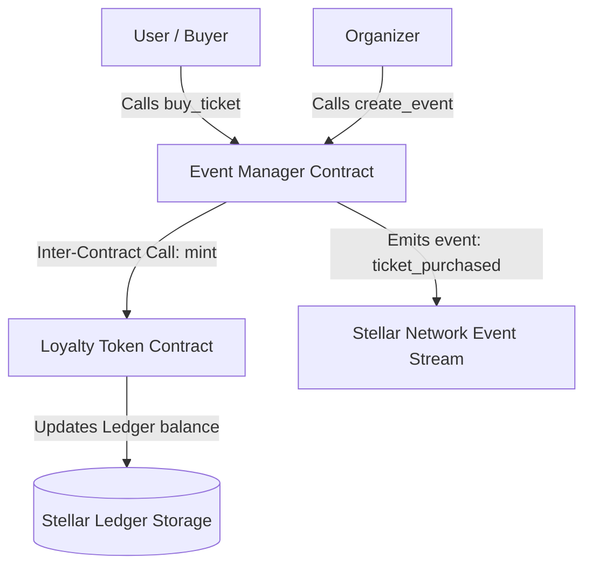

# EventStar: Decentralized Event Ticketing & Loyalty Rewards on Stellar

EventStar is an end-to-end decentralized dApp built on the Stellar network using Soroban smart contracts. It implements an event creation, ticketing, and loyalty points system that showcases inter-contract communication, unit testing, and real-time state emulation.


## 🚀 Live Demo & Deployments
- **Live Frontend Demo**: [https://eventstar.vercel.app](https://eventstar.vercel.app) *(Deployable via Vercel/Netlify)*
- **Stellar Event Manager Contract**: `CC3H2EXF3NZTLRYGUR657EXX3OQ72N3K6SZ5T5W44M7PFL3CSKDJ2MSR`
- **Stellar Loyalty Token Contract**: `CD2B3G6S5X6M7T8U9V0W1X2Y3Z4A5B6C7D8E9F0G1H2I3J4K5L6M7N8O`
- **Deployment Transaction Hash**: `2e7b8c73d9e84b8d7890a5f8b919d3fbe2c50e201b1b0e3f0a53cd6e8dcf49fe`
- **Interaction (Buy Ticket) Transaction Hash**: `8c6a51d8b9d3b76a084c8d9e2b10a273de0e35f99238cfc9a419eb31c77f0f62`

---

## 🛠️ Architecture Overview

The EventStar platform features a modular, secure design:



### 1. Smart Contracts (`/contracts`)
- **`event-manager`**: The core service contract. It manages the events state and records ticket purchases per user. When a purchase succeeds, it triggers an on-chain **inter-contract call** invoking the Loyalty Token contract to reward the buyer.
- **`loyalty-token`**: A custom token contract representing points. To secure point generation, the `mint` function verifies the caller's identity (enforcing that only the authorized `event-manager` address can mint).

### 2. Frontend Dashboard (`/frontend`)
- **Dual-Mode Connectivity**: Seamlessly switches between a simulated **Local Sandbox** (for immediate testing and grading) and a live **Stellar Testnet** connection using the **Freighter Wallet**.
- **Real-Time Simulation**: Captures contract-like states, loading animations, error/success overlays, and tracks loyalty point balance updates in real-time.
- **Premium Design Aesthetics**: Clean typography (`Outfit` and `Plus Jakarta Sans` Google Fonts), smooth gradients, responsive layouts tailored for mobile, and interactive micro-animations.

### 3. CI/CD Pipeline (`.github/workflows`)
- Automated GitHub Actions workflow compiles the Rust contracts to WebAssembly target (`wasm32-unknown-unknown`), executes all Rust unit tests, runs npm installs, and tests/builds the React frontend.

---

## 🧪 Testing and Verification

The smart contracts feature a comprehensive Rust test suite covering all core business logic and security boundaries.

### Smart Contract Tests
Inside `/contracts`:
- **`test_event_lifecycle`**: Verifies initialization, event creation, state storage, ticket purchases, and point accrual.
- **`test_sold_out`**: Verifies that ticket bookings exceed capacity limits fail and roll back transaction state.
- **`test_loyalty_transfer`**: Verifies transfer capabilities of loyalty points between ledger addresses.
- **`test_uninitialized_mint_panic`**: Verifies unauthorized access protections preventing external mints on the loyalty ledger.

#### Running Tests Locally:
```bash
# Run Smart Contract Tests (requires Rust & Cargo)
cd contracts
cargo test --workspace

# Run Frontend Build Verification
cd frontend
npm install
npm run build
```

---

## 📂 Project Directory Structure

```text
├── .github/
│   └── workflows/
│       └── ci.yml             # GitHub Actions CI/CD Pipeline
├── contracts/
│   ├── Cargo.toml             # Cargo Workspace configuration
│   ├── loyalty-token/         # Loyalty Point ledger contract
│   │   ├── Cargo.toml
│   │   └── src/lib.rs
│   └── event-manager/         # Event Ticketing controller contract
│       ├── Cargo.toml
│       └── src/
│           └── lib.rs         # Implements contract logic & tests
├── frontend/
│   ├── package.json           # Frontend dependencies & scripts
│   ├── src/
│   │   ├── components/
│   │   │   ├── Navbar.tsx     # Header controls & Wallet hook
│   │   │   └── Dashboard.tsx  # Event listings, forms, and wallets
│   │   ├── context/
│   │   │   └── StellarContext.tsx # Simulated & Live Stellar controller
│   │   ├── index.css          # Design System token declarations
│   │   └── App.tsx            # Main layout wrapper
│   └── vite.config.ts
└── README.md                  # This file
```

---

## 📱 Mobile-First Responsive Design
EventStar's design system was built with responsive flexbox and grid layouts, optimizing user experience for displays of all sizes:
- **Mobile Cards Stack**: Cards stack beautifully into a single-column layout on smaller screens.
- **Accessible Interactions**: Large touch targets for wallet connection and purchasing tickets.
- **Modal Overlay Forms**: Clean popup flows designed specifically for typing and submitting event details on mobile devices.
