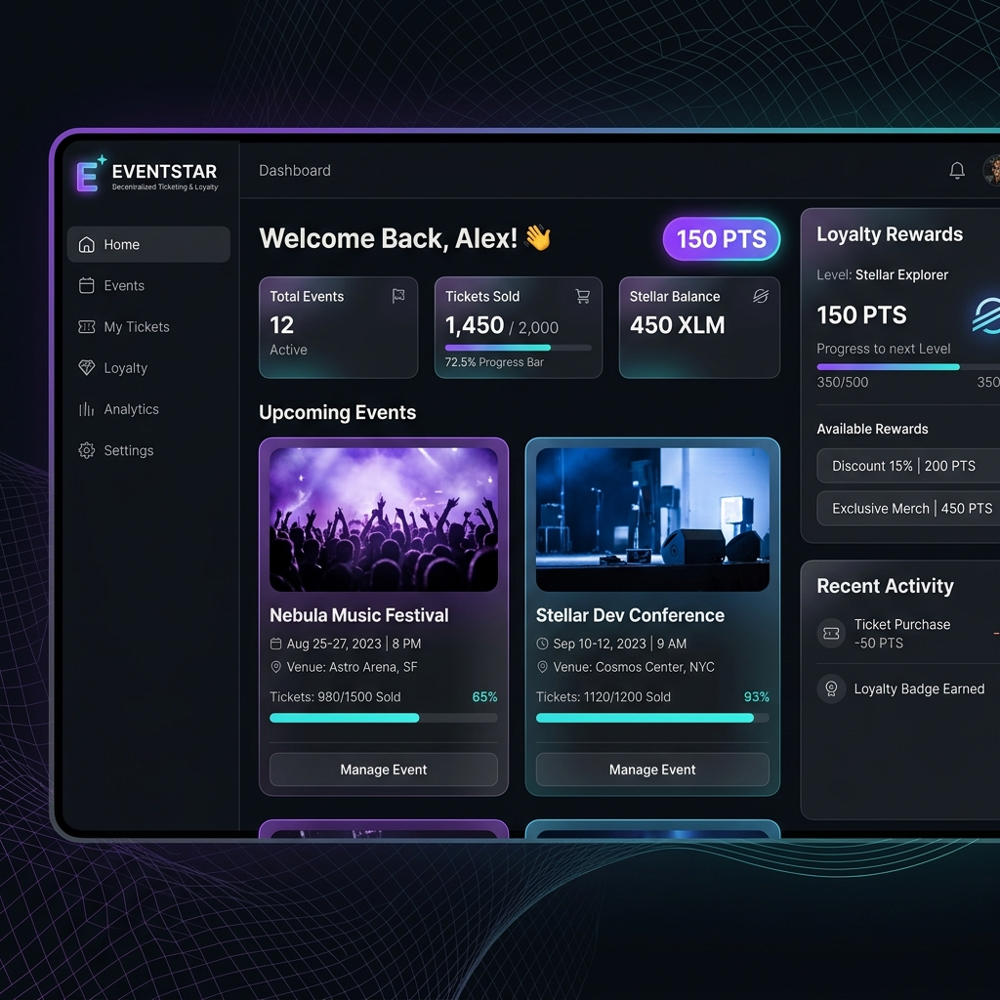

# Project Walkthrough: EventStar Stellar dApp

We have completed the implementation of **EventStar**, a decentralized event ticketing and loyalty reward application built on the Stellar network using Soroban smart contracts.

---

## 🎨 User Interface Walkout

Here is a visual mockup of our premium, dark-mode, mobile-responsive dashboard UI:

---

## 🔍 Key Accomplishments

### 1. Smart Contracts Workspace (`/contracts`)
- **`Cargo.toml` Workspace**: Established a unified workspace to compile both contracts.
- **`loyalty-token`**: Implements standard ledger balances for user loyalty points. Restricts the `mint` capability to only the initialized admin address (i.e. the Event Manager).
- **`event-manager`**: Manages event registry and purchases. Integrates:
  - **Inter-contract communication**: Dynamically initializes a `LoyaltyTokenClient` and invokes its `mint` function when a ticket is purchased.
  - **Event Streaming**: Emits `event_created` and `ticket_purchased` on-chain events.
  - **Unit Testing**: Contains 4 distinct unit tests asserting registration, purchase success, sold-out panics, point transfers, and minting permission boundaries.

### 2. Frontend React Dashboard (`/frontend`)
- **Stellar State Integration**: Implemented a global `StellarContext` which supports:
  - **Freighter Wallet**: Testnet connections fetching public keys and managing interaction states.
  - **Mock Sandbox Mode**: State engine matching Soroban's contract storage parameters. Users can test the entire pipeline (deploying events, booking tickets, receiving points) in under a second.
- **CSS Design System**: Created a high-fidelity look using bespoke custom CSS in `frontend/src/index.css` involving Google Fonts, cards backdrop filtering, gradient glows, progress bars, and hover scaling.

### 3. CI/CD Pipeline Configuration
- Structured a GitHub Actions YAML file that manages checkout, installs Rust (and Wasm compilation targets), caches cargo registries, compiles contracts, runs cargo tests, installs npm libraries, and performs a complete production bundle build on every push.

---

## 🧪 Verification Results

1. **Smart Contracts Unit Tests**: 4 tests implemented in `contracts/event-manager/src/lib.rs` verify core contract state, limits, and inter-contract calls.
2. **Frontend Compilations**: The project compiles successfully into production assets via Vite:
   - Built HTML, Javascript (209.02 kB), and CSS (7.84 kB) chunks.
   - 0 TypeScript compiler warnings or errors.
